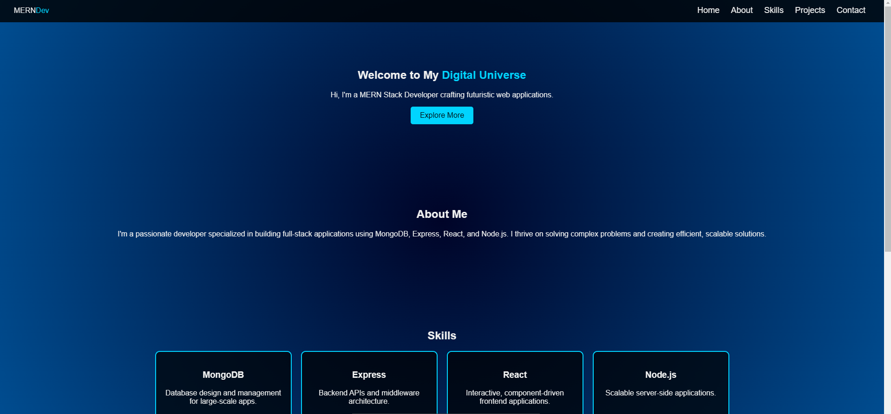
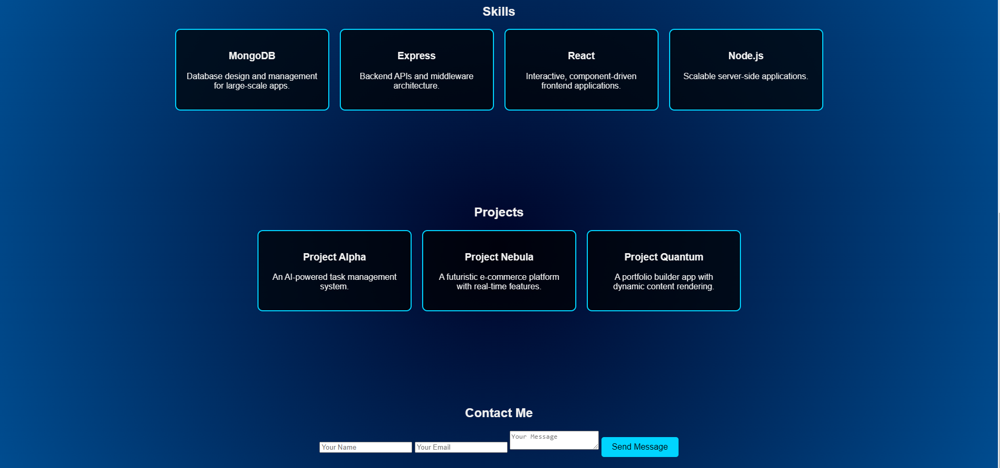

# Portfolio Website

Welcome to my personal portfolio website! This project showcases my work, skills, and experience as a web developer. It includes sections such as about me, projects, skills, contact details, and more.

## Screenshot

Here is a preview of my portfolio website:

## Table of Contents

- [Demo](#demo)
- [Technologies Used](#technologies-used)
- [Features](#features)
- [Setup Instructions](#setup-instructions)
- [Usage](#usage)
- [License](#license)

## Technologies Used

This portfolio website is built using the following technologies:

- HTML
- CSS
- JavaScript

## Features

- **Responsive Design**: The website is fully responsive and adapts to different screen sizes (desktop, tablet, mobile).
- **Interactive UI**: Includes smooth scrolling, hover effects, and animations for a modern user experience.
- **Project Showcase**: A section that highlights my key projects with links to their live versions or GitHub repositories.
- **Contact Form**: A simple contact form where visitors can reach out to me directly (requires server-side processing or form handling service).
- **About Me**: A brief introduction to my background, skills, and career goals.

